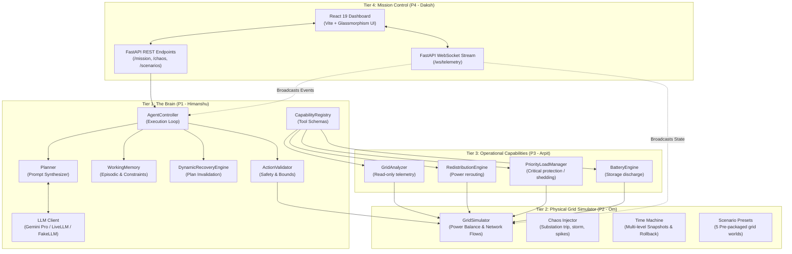

# GridMind ⚡

> **Build the Brain, Not the Puppet**  
> A from-scratch autonomous agent framework featuring real-time dynamic planning, capability discovery, ground-truth outcome verification, and adaptive failure recovery inside a simulated high-voltage power grid.

[](file:///backend/tests/)
[](https://www.python.org/)
[](https://fastapi.tiangolo.com/)
[](https://vitejs.dev/)
[](file:///backend/llm/)
[](LICENSE)

---

## 📑 Table of Contents
- [1. Executive Summary](#1-executive-summary)
- [2. Core Engineering Principles](#2-core-engineering-principles)
- [3. System Architecture](#3-system-architecture)
- [4. Team Four-Feit Ownership Matrix](#4-team-four-feit-ownership-matrix)
- [5. Repository Structure](#5-repository-structure)
- [6. Getting Started](#6-getting-started)
- [7. LLM Configuration (Gemini Pro & Others)](#7-llm-configuration-gemini-pro--others)
- [8. Pre-Packaged Grid Scenarios](#8-pre-packaged-grid-scenarios)
- [9. The Pitch Scenario (Step-by-Step)](#9-the-pitch-scenario-step-by-step)
- [10. Testing & Verification](#10-testing--verification)
- [11. API & WebSocket Telemetry Reference](#11-api--websocket-telemetry-reference)
- [12. Track 2 Bonus: GridMind vs. LangChain / CrewAI](#12-track-2-bonus-gridmind-vs-langchain--crewai)


---

## 1. Executive Summary

Most "agent" demonstrations are brittle puppets: thin wrappers over LangChain, CrewAI, or AutoGen using hardcoded `if/else` control flow or optimistic prompting that assumes actions always succeed.

**GridMind is built from first principles with zero external agent frameworks.**

We built the agent brain from scratch. The agent operates inside an active high-voltage power grid where physics govern outcomes: transmission lines have thermal limits, substations trip under load, renewable generation fluctuates with weather, and hospitals must remain energized at all costs.

When an action fails (such as rerouting power over an overloaded line), the framework treats the failure as a **first-class citizen**: invalidating the plan, writing dynamic constraints to episodic memory, and forcing the LLM to formulate an alternate strategy to maintain critical life-support systems.

```text
               ┌────────────────────────────────────────────────────────┐
               │              GridMind Autonomous Loop                  │
               └────────────────────────────────────────────────────────┘
                                           │
                                           ▼
┌──────────────────┐               ┌───────────────┐               ┌──────────────────┐
│ Observe Ground   │ ────────────> │ Synthesize    │ ────────────> │ Select Dynamic   │
│ Truth Telemetry  │               │ LLM Prompt    │               │ Capability       │
└──────────────────┘               └───────────────┘               └──────────────────┘
         ▲                                                                   │
         │                                                                   ▼
┌──────────────────┐               ┌───────────────┐               ┌──────────────────┐
│ Update Memory &  │ <──────────── │ Execute Tool  │ <──────────── │ Validate Action  │
│ Constraints      │   (Failure)   │ on Physics    │   (Pass)      │ Against Schema   │
└──────────────────┘               └───────────────┘               └──────────────────┘
         │                                 │
         │ (Replan)                        │ (Success)
         ▼                                 ▼
┌──────────────────┐               ┌───────────────┐
│ Dynamic Recovery │               │ Mission Goal  │
│ & Plan Shift     │               │ Verified Safe │
└──────────────────┘               └───────────────┘
```

---

## 2. Core Engineering Principles

1. **Zero External Agent Frameworks**: No LangChain, no CrewAI, no AutoGen. The cognitive loop, planner, memory, tool registry, and validation engine are custom-engineered in vanilla Python.
2. **Pure Dynamic Tool Routing (Rule 6 Compliant)**: There is zero hardcoded decision logic (`if failed: do_y()`). The agent discovers available capabilities via standardized JSON schemas and dynamically reasons about which tool to deploy.
3. **Failures as First-Class Citizens**: Tools can and do fail. Physical line limits cause transmission overloads. The framework captures failure diagnostics, marks the attempt in working memory, derives physical constraints, and triggers explicit replanning.
4. **Code-Verified Ground Truth**: The LLM is never trusted when it claims success. Only simulator invariant checks and physical metric equations confirm if a goal is reached.
5. **Decoupled Architecture**: Strict separation of concerns between The Brain (P1), The World Simulator (P2), Operational Capabilities (P3), and Mission Control UI (P4).

---

## 3. System Architecture



---

## 4. Team Four-Feit Ownership Matrix

| Tier | Role | Lead | Focus Components | Primary Directory |
|:---:|:---:|:---:|:---|:---|
| **P1** | **The Brain** | **Himanshu** | Agent loop, planner, working memory, dynamic recovery, capability registry, action validator, LLM client | `backend/core/`, `backend/llm/` |
| **P2** | **The World** | **Om** | Physical grid simulator, power flow solver, constraint engine, invariants fuzzer, snapshot time machine | `backend/grid/` |
| **P3** | **The Hands** | **Arpit** | Operational tools (Analyzer, Redistribution, Priority Load Manager, Battery reserve) | `backend/capabilities/` |
| **P4** | **The Window** | **Daksh** | FastAPI orchestrator, WebSocket telemetry broadcast, React 19 glassmorphism dashboard | `backend/api/`, `frontend/` |

---

## 5. Repository Structure

```text
GridMind/
├── backend/
│   ├── api/                     # Tier 4: FastAPI & WebSockets (P4)
│   │   ├── routes.py            # REST endpoints (/mission, /chaos, /scenarios)
│   │   ├── service.py           # Service orchestrator connecting P1, P2, P3
│   │   └── websocket.py         # Real-time WebSocket broadcaster
│   ├── capabilities/            # Tier 3: Operational Capabilities (P3)
│   │   ├── analyzer.py          # GridAnalyzer diagnostic tool
│   │   ├── battery.py           # BatteryEngine energy discharge tool
│   │   ├── priority_manager.py  # PriorityLoadManager load shedding tool
│   │   ├── redistribution.py    # RedistributionEngine rerouting tool
│   │   └── validator.py         # Outcome validator
│   ├── core/                    # Tier 1: The Brain Framework (P1)
│   │   ├── agent.py             # AgentController master autonomous loop
│   │   ├── events.py            # AgentEvent schemas & EventBus
│   │   ├── memory.py            # WorkingMemory & dynamic constraint tracker
│   │   ├── planner.py           # Telemetry builder & decision mapper
│   │   ├── recovery.py          # DynamicRecoveryEngine (replan / invalidate)
│   │   ├── registry.py          # CapabilityRegistry & ToolSpec generator
│   │   ├── state.py             # MissionState & AgentMetrics
│   │   └── validator.py         # ActionValidator (physical & schema validation)
│   ├── grid/                    # Tier 2: Physical Grid Simulation (P2)
│   │   ├── constraints.py       # Grid constraint checkers
│   │   ├── events.py            # ChaosEvent definitions
│   │   ├── models.py            # Pydantic models (Substation, Line, Load, Battery)
│   │   ├── power_balance.py     # Kirchhoff & power balance flow engine
│   │   ├── scenarios.py         # 5 Pre-packaged grid profiles
│   │   └── simulator.py         # GridSimulator with snapshot rollback
│   ├── llm/                     # LLM Adapters (P1)
│   │   ├── client.py            # LiveLLMClient (Gemini Pro/OpenAI) + FakeLLM
│   │   ├── prompts.py           # System prompts & schema synthesis
│   │   └── schemas.py           # Structured JSON output parser
│   ├── tests/                   # 73 Unit & Integration Tests
│   │   ├── integration/         # Milestone 1, API, WebSocket, and End-to-End tests
│   │   └── unit/                # Brain, Simulator, Capability, Invariant unit tests
│   └── main.py                  # Backend FastAPI uvicorn entrypoint
├── docs/                        # Complete Technical Documentation
│   ├── api-reference.md         # Full REST & WebSocket API specification
│   ├── architecture.md          # In-depth architectural breakdown
│   ├── contracts.md             # Frozen P1-P4 data schemas and contracts
│   ├── demo-scenario.md         # Canonical demo presentation script
│   ├── getting-started.md       # Onboarding and environment guide
│   ├── p4-integration.md        # Frontend & integration guide
│   └── testing.md               # Testing guidelines & verification
├── frontend/                    # Tier 4: React 19 + Vite Dashboard (P4)
│   ├── src/
│   │   ├── components/
│   │   │   ├── agent/           # AgentBrainPanel (LLM thought trace & memory)
│   │   │   ├── chaos/           # ChaosControlPanel (interactive fault injection)
│   │   │   ├── dashboard/       # MetricsGrid & MissionHeader
│   │   │   ├── events/          # EventTimeline (live chronological audit)
│   │   │   └── grid/            # PowerGridVisualizer (interactive SVG topology)
│   │   ├── pages/               # DashboardPage, ArchitecturePage, LandingPage
│   │   └── services/            # api.js & websocket.js clients
│   └── vite.config.js           # Vite dev proxy configuration
├── .env.example                 # Environment configuration template
├── requirements.txt             # Python backend dependencies
└── README.md                    # Project documentation
```

---

## 6. Getting Started

### Prerequisites
- **Python**: 3.11, 3.12, or 3.13
- **Node.js**: v18 or higher (with npm)
- **Git**

### 1. Clone the Repository
```bash
git clone https://github.com/Four-Feit/GridMind.git
cd GridMind
```

### 2. Backend Setup
Create and activate a virtual environment:
```bash
python3 -m venv venv
source venv/bin/activate   # On Windows: venv\Scripts\activate
```

Install Python dependencies:
```bash
pip install -r requirements.txt
```

Run the backend server:
```bash
python3 -m backend.main
```
*The FastAPI backend will start on `http://localhost:8000` with hot-reloading enabled.*

### 3. Frontend Setup
In a new terminal window:
```bash
cd frontend
npm install
npm run dev
```
*Open `http://localhost:5173` (or `http://localhost:5174` if 5173 is occupied) in your browser.*

---

## 7. LLM Configuration (Gemini Pro & Others)

GridMind includes a dual-mode LLM layer. It runs completely offline with **zero configuration** using dynamic deterministic heuristics, OR connects seamlessly to any real LLM provider.

### Using Google Gemini Pro (Recommended)
Copy the environment template:
```bash
cp .env.example .env
```

Open `.env` and paste your Google AI Studio key:
```env
GEMINI_API_KEY=AIzaSyYourActualGeminiKeyHere
LLM_MODEL=gemini-1.5-pro
```
*`LiveLLMClient` automatically detects the Gemini key, configures Google's official OpenAI-compatible endpoint (`https://generativelanguage.googleapis.com/v1beta/openai/`), and enforces structured JSON output mode.*

### Other Supported Providers
- **OpenAI**: Set `OPENAI_API_KEY=sk-...` and `LLM_MODEL=gpt-4o-mini`.
- **Groq (Fast / Free tier)**: Set `GROQ_API_KEY=gsk_...` and `LLM_MODEL=llama-3.3-70b-versatile`.
- **Ollama (Local)**: Set `LLM_BASE_URL=http://localhost:11434/v1` and `LLM_MODEL=llama3`.

---

## 8. Pre-Packaged Grid Scenarios

Om's physical simulator contains 5 pre-packaged grid scenarios that can be loaded dynamically via the API (`POST /scenarios/load`) or via the UI:

| Scenario ID | Name | Description | Challenge for the Agent |
|---|---|---|---|
| `baseline` | **Standard Demo Baseline** | Balanced 180 MW generation vs 150 MW demand. | Routine telemetry scanning and maintenance. |
| `cascade_failure` | **Cascade Substation Collapse** | Substation S2 tripped, isolating critical Hospital. | Requires rerouting attempt, recovery from TL4 overload, and priority load shedding. |
| `heatwave_stress` | **Summer Heatwave Stress** | Cooling demand surges to 180 MW, solar derates. | Power deficit requiring battery storage deployment and industrial load shedding. |
| `islanded_grid` | **Islanded Substation Outage** | TL1 severed, disconnecting conventional generation. | Tests localized microgrid management and battery reserve pacing. |
| `renewable_dusk` | **Renewable Solar Dusk** | Solar generation ramps to 0 MW at sunset. | 10 MW generation deficit requiring automated battery compensation. |

---

## 9. The Pitch Scenario (Step-by-Step)

The canonical demonstration scenario showcases how the Brain handles failure and adapts:

```text
[BASELINE] 180 MW Gen | 150 MW Demand | Hospital, Water Plant, Emergency Services 100% powered
   │
   ▼
1. CHAOS INJECTION: Substation S2 trips offline!
   - Hospital (30 MW) is abruptly disconnected from the grid.
   │
   ▼
2. AGENT DECISION: LLM observes outage and invokes `redistribution_engine`
   - Attempts to route power to S2 via transmission line TL4.
   │
   ▼
3. PHYSICAL FAILURE: Transmission Line TL4 thermal limit breached!
   - TL4 capacity is 60.0 MW; rerouting forces 71.0 MW across the line.
   - RedistributionEngine returns: `TRANSMISSION_OVERLOAD` (success: False).
   │
   ▼
4. DYNAMIC RECOVERY & MEMORY:
   - ActionValidator confirms physical failure.
   - DynamicRecoveryEngine emits: `PLAN_INVALIDATED` and `REPLAN_STARTED`.
   - WorkingMemory records learned constraint: `"avoid overloading line TL4"`.
   │
   ▼
5. REPLANNING & RESOLUTION:
   - LLM synthesizes new context containing the learned constraint.
   - LLM dynamically selects `priority_load_manager` with `protect_critical=True`.
   - Result: Sheds non-critical FACTORY (40 MW), restoring full power to HOSPITAL (30 MW).
   │
   ▼
6. SECOND CHAOS: Weather storm reduces Solar generation by 30 MW.
   - Generation deficit detected (150 MW gen vs 150 MW demand).
   - Agent deploys `battery_engine` for 25 MW reserve discharge.
   │
   ▼
7. GROUND-TRUTH CONFIRMATION:
   - OutcomeValidator verifies: All critical loads connected, zero line overloads.
   - Mission status transitions to: COMPLETED.
```

---

## 10. Testing & Verification

Every component is covered by comprehensive unit and integration test suites:

```bash
pytest -v
```

### Test Suite Summary:
```text
collected 73 items

backend/tests/integration/test_integration.py::test_end_to_end_agent_simulator_capabilities PASSED [  1%]
backend/tests/integration/test_milestone_1.py::test_milestone_1_agent_observes_simulator PASSED   [  2%]
backend/tests/integration/test_p4_api.py::test_root_endpoint PASSED                                [  4%]
backend/tests/integration/test_p4_api.py::test_get_grid_state PASSED                               [  5%]
backend/tests/integration/test_p4_api.py::test_get_agent_state PASSED                              [  6%]
backend/tests/integration/test_p4_api.py::test_get_capabilities PASSED                             [  8%]
backend/tests/integration/test_p4_api.py::test_chaos_event_injection_substation PASSED             [  9%]
backend/tests/integration/test_p4_api.py::test_mission_lifecycle_step_and_replan PASSED            [ 10%]
backend/tests/integration/test_p4_api.py::test_mission_reset_and_stop PASSED                       [ 12%]
backend/tests/integration/test_p4_api.py::test_websocket_telemetry_stream PASSED                   [ 13%]
backend/tests/integration/test_p4_api.py::test_list_and_load_scenarios PASSED                     [ 15%]
backend/tests/unit/test_agent_core.py::test_agent_core_recovery_and_replan PASSED                  [ 16%]
backend/tests/unit/test_capabilities.py::test_grid_analyzer_detects_outages_and_overloads PASSED  [ 20%]
backend/tests/unit/test_capabilities.py::test_redistribution_overload_demo_failure PASSED        [ 21%]
backend/tests/unit/test_capabilities.py::test_priority_manager_protect_critical PASSED             [ 26%]
backend/tests/unit/test_capabilities.py::test_battery_engine_success PASSED                       [ 28%]
backend/tests/unit/test_dynamic_routing.py::test_dynamic_tool_selection_across_states PASSED     [ 38%]
backend/tests/unit/test_grid_invariants.py::test_randomized_chaos_invariant_fuzzer PASSED         [ 42%]
backend/tests/unit/test_grid_invariants.py::test_time_machine_multilevel_snapshots PASSED         [ 43%]
backend/tests/unit/test_llm.py::test_gemini_client_auto_detection PASSED                          [ 57%]
backend/tests/unit/test_memory_recovery.py::test_recovery_engine_handles_tool_failure PASSED      [ 63%]
backend/tests/unit/test_registry_validator.py::test_validator_outcome_critical_deficit PASSED     [ 79%]
backend/tests/unit/test_simulator.py::test_power_flow_engine_and_reroute_estimation PASSED        [ 97%]
...
======================== 73 passed, 1 warning in 0.20s =========================
```

---

## 11. API & WebSocket Telemetry Reference

### REST Endpoints

| Method | Endpoint | Description |
|---|---|---|
| `GET` | `/grid/state` | Returns the real-time physical power grid state. |
| `GET` | `/agent/state` | Returns mission status, cycle count, and working memory context. |
| `GET` | `/capabilities` | Returns registered tool specifications with JSON schemas. |
| `GET` | `/scenarios` | Lists all available pre-packaged grid scenarios. |
| `POST` | `/scenarios/load` | Loads a specific scenario profile into the simulator. |
| `POST` | `/mission/start` | Starts an autonomous mission loop (`goal`, `pace_seconds`, `auto_run`). |
| `POST` | `/mission/step` | Manually triggers a single agent observation $\to$ plan $\to$ execute cycle. |
| `POST` | `/mission/stop` | Pauses or stops the active mission loop. |
| `POST` | `/mission/reset` | Resets the simulator and agent to nominal baseline. |
| `POST` | `/chaos/event` | Injects physical failures (`SUBSTATION_FAILURE`, `DEMAND_SPIKE`, etc.). |
| `GET` | `/events` | Returns the chronological execution audit trace. |

### WebSocket Telemetry Stream
Connect to `ws://localhost:8000/ws`:
- **Client $\to$ Server**: `{"action": "ping", "timestamp": 12345}`
- **Server $\to$ Client**: Real-time broadcasts for every emitted `AgentEvent`:
  - `OBSERVATION_RECORDED`
  - `PLAN_CREATED`
  - `TOOL_SELECTED`
  - `TOOL_EXECUTED`
  - `ACTION_FAILED`
  - `PLAN_INVALIDATED`
  - `REPLAN_STARTED`
  - `MISSION_COMPLETED`

---

## 12. Track 2 Bonus: GridMind vs. LangChain / CrewAI

> *"Compare your framework's behavior on the same task against a standard framework like LangChain, and explain the difference."*

We created a detailed comparison document outlining why standard off-the-shelf frameworks fail on physical power grid tasks, and how GridMind solves it:

👉 **Read the Full Comparison: [docs/langchain-comparison.md](docs/langchain-comparison.md)**

### Key Highlights:
1. **The Overload Trap**: When line `TL4` hits its 60.0 MW thermal limit, vanilla LangChain (`AgentExecutor`) typically gets stuck in an infinite retry loop or hallucinates that power was restored.
2. **Dynamic Recovery**: GridMind catches `TRANSMISSION_OVERLOAD`, triggers `PLAN_INVALIDATED`, writes `"avoid overloading line TL4"` to `WorkingMemory`, and prompts Gemini to pivot to load shedding (`priority_load_manager`).
3. **Code-Verified Truth**: While LangChain trusts the LLM's self-congratulatory output, GridMind's `OutcomeValidator` requires mathematical proof that critical loads are energized before concluding the mission.

---

## 👥 Team Four-Feit
*Built with ❤️ for Track 2: Build the Brain, Not the Puppet.*

- **Himanshu Singh** — P1 (The Brain / Framework Architect)
- **Om** — P2 (Grid World & Physics Simulator)
- **Arpit** — P3 (Operational Capabilities & Tools)
- **Daksh** — P4 (Integration, API & Mission Control UI)
