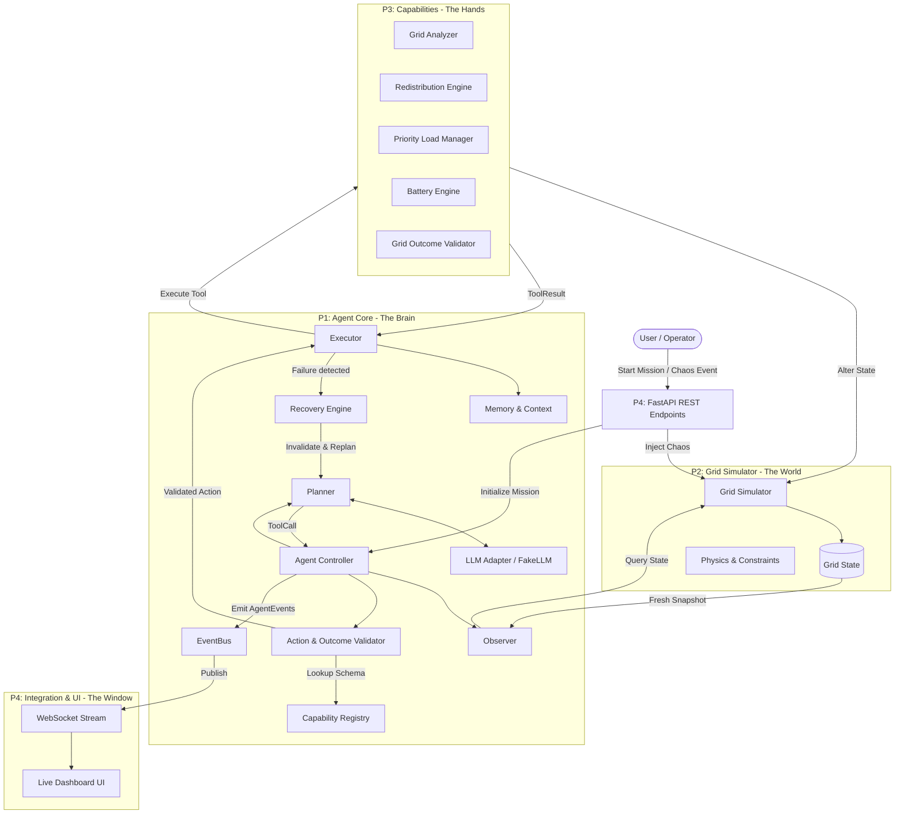
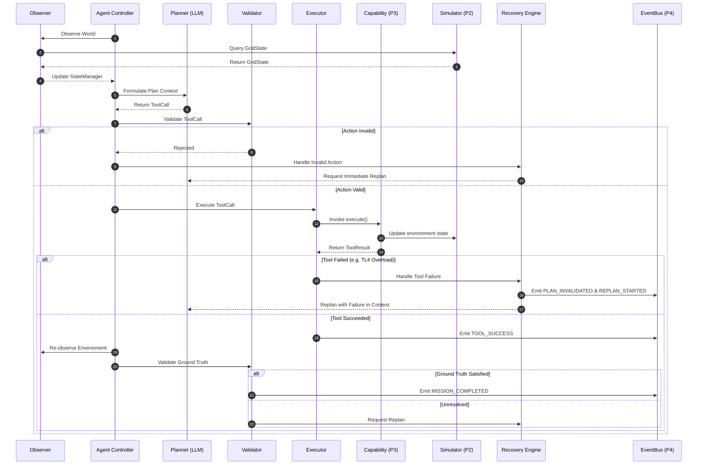

# GridMind Architecture

## System Flow & Component Diagram

---

## Agent Execution Loop

The agent strictly follows an 8-stage autonomous lifecycle:

---

## P4 $\leftrightarrow$ P1 Communication Protocol

1. **REST Endpoints (`backend/api/routes.py`)**:
   - P4 exposes HTTP endpoints (`/mission/start`, `/chaos/event`) that trigger actions in P1's `AgentController` and P2's `GridSimulator`.
2. **EventBus $\leftrightarrow$ WebSocket Pipeline (`backend/api/websocket.py`)**:
   - P1's `EventBus` notifies registered listeners whenever an `AgentEvent` is emitted.
   - P4 registers a listener on startup that converts `AgentEvent` objects into WebSocket JSON envelopes and broadcasts them live to connected dashboard clients.

---

## LLM Client Architecture & Switching

- All LLM interactions are decoupled behind the `LLMClient` protocol in `backend/llm/client.py`.
- **`FakeLLM`**: Deterministic mock provider that plays scripted sequences for unit testing, offline development, and zero-token CI/CD runs.
- **`OpenAILikeClient` / Live Adapters**: Invokes live APIs (Gemini, OpenAI) using the environment variable `LLM_API_KEY` and `LLM_MODEL`.
- The planner switch between Mock and Live API is controlled via configuration without modifying a single line of agent orchestration logic.
