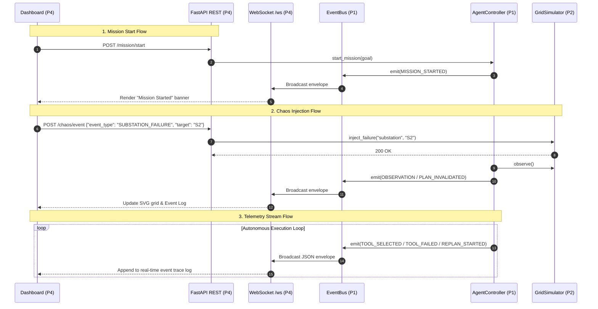

# P4 Integration Guide: FastAPI, WebSockets & Dashboard

> **Owner**: P4 (Integration & UI)
> **Purpose**: Documents how the FastAPI backend, EventBus, WebSocket telemetry stream, and frontend dashboard interact.

---

## 1. Overview & Data Flow



---

## 2. EventBus $\to$ WebSocket Broadcast Bridge

P1 emits strongly typed `AgentEvent` objects synchronously inside the agent cycle. To stream these without blocking the agent:

```python
# backend/api/websocket.py
from backend.core.events import AgentEvent, EventBus
from backend.api.websocket import manager

def register_telemetry_bridge(event_bus: EventBus):
    """Subscribes to P1 EventBus and forwards events to WebSocket clients."""
    def on_agent_event(event: AgentEvent):
        envelope = {
            "channel": "agent_events",
            "timestamp": event.timestamp,
            "payload": event.model_dump()
        }
        # Schedule async broadcast to all connected WebSocket clients
        import asyncio
        asyncio.create_task(manager.broadcast_event(envelope))

    event_bus.subscribe(on_agent_event)
```

---

## 3. WebSocket Message Specification

- **URL**: `ws://localhost:8000/ws`
- **Envelope Format**:
  ```json
  {
    "channel": "agent_events",
    "timestamp": 1720000000.123,
    "payload": {
      "timestamp": 1720000000.123,
      "type": "TOOL_FAILED",
      "plan_id": 1,
      "tool": "redistribution_engine",
      "message": "Tool redistribution_engine failed: TL4 overload",
      "data": {
        "line": "TL4",
        "attempted_mw": 71.0,
        "capacity_mw": 60.0
      }
    }
  }
  ```

### Canonical Event Types to Render in UI:
- `MISSION_STARTED` (Badge: Blue)
- `OBSERVATION` (Badge: Gray)
- `PLAN_CREATED` (Badge: Cyan)
- `TOOL_SELECTED` (Badge: Purple)
- `TOOL_STARTED` (Badge: Yellow)
- `TOOL_SUCCESS` (Badge: Green)
- `TOOL_FAILED` (Badge: Red)
- `TOOL_REJECTED` (Badge: Orange)
- `PLAN_INVALIDATED` (Badge: Amber)
- `REPLAN_STARTED` (Badge: Purple)
- `VALIDATION_STARTED` (Badge: Gray)
- `VALIDATION_PASSED` (Badge: Green)
- `VALIDATION_FAILED` (Badge: Red)
- `MISSION_COMPLETED` (Badge: Bright Green / Confetti)
- `MISSION_FAILED` (Badge: Dark Red)
- `CHAOS_EVENT` (Badge: Crimson)

---

## 4. Frontend Dashboard Architecture

Recommended layout:

```text
+-------------------------------------------------------------------------------+
| GridMind Operator Dashboard                   [Status: RUNNING] [Plans: 3]     |
+------------------------------------+------------------------------------------+
| TOP METRICS BAR                    |                                          |
| Gen: 180 MW | Demand: 150 MW       | Battery: 80 MWh | Balance: +30 MW Surplus|
+------------------------------------+------------------------------------------+
| LEFT PANEL (Grid Topology SVG)     | RIGHT PANEL (Agent Brain & Trace)        |
|                                    |                                          |
| [G1: 140MW]----[S1]                | Active Mission: "Protect Hospital"       |
|                 |                  | Current Plan: Plan #3 (Battery Engine)   |
|               (TL1)                |                                          |
|                 |                  | --- LIVE EVENT TRACE ---                 |
| [G2: 40MW] ----[S2: OFFLINE]       | 22:04:10 [TOOL_SELECTED] redistribution  |
|                 |                  | 22:04:11 [TOOL_FAILED] TL4 overload      |
|               (TL4: ALERT)         | 22:04:11 [PLAN_INVALIDATED] Plan #1      |
|                 |                  | 22:04:12 [REPLAN_STARTED] Dynamic replan |
|                [S3]                | 22:04:13 [TOOL_SUCCESS] priority_manager |
|                 |                  | 22:04:14 [MISSION_COMPLETED] Verified    |
|      +----------+----------+       |                                          |
|  [Hospital]   [Factory: SHED]      |                                          |
+------------------------------------+------------------------------------------+
| BOTTOM PANEL (Operator Chaos Controls)                                        |
| [⚡ Fail Substation S2] [⛅ Weather Drop] [📈 Demand Spike] [🔄 Reset Grid]    |
+-------------------------------------------------------------------------------+
```

---

## 5. Testing the P4 Integration

Run integration test for API & WebSockets:
```bash
python -m pytest backend/tests/integration/test_p4_api.py -v
```
