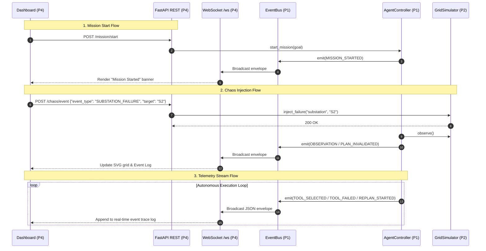

# P4: Integration, FastAPI Layer, WebSocket Streaming & Cinematic UI

This document details the architecture, contracts, run instructions, and testing strategy for **P4 (The Window)** in GridMind.

---

## 1. P4 Ownership & Boundaries

In accordance with GridMind architectural contracts:
- **P4 Owns**:
  - `backend/api/` (API routes, WebSocket streaming manager, and integration service adapter)
  - `frontend/` (React 19 + Vite cinematic control-room user interface)
  - `backend/tests/integration/test_p4_api.py` (P4 integration test suite)
  - `docs/p4-integration.md` (Integration documentation)
- **P4 Does NOT Modify**:
  - P1 Agent Core, memory, planner, or decision-making logic.
  - P2 Grid Simulator models, physical law constraints, or power balance logic.
  - P3 Capability implementations or safety schemas.
  - No hardcoded routing rules or direct frontend-to-simulator state mutations.

---

## 2. Architecture & Real-Time Telemetry Bridge

```text
+-------------------------------------------------------------+
|                      Browser UI (P4)                        |
|  - Landing Page ("Build the Brain, Not the Puppet")         |
|  - PowerGridVisualizer (Topology, flow, fault highlights)   |
|  - AgentBrainPanel (Observe -> Plan -> Execute -> Recovery) |
|  - EventTimeline (Filterable chronological execution trace) |
|  - ChaosControlPanel (Substation trip, storm, surge)       |
+-------------------------------------------------------------+
            ▲ HTTP (REST)                  ▲ WebSocket (/ws)
            │                              │
+-------------------------------------------------------------+
|                     FastAPI Layer (P4)                      |
|  - backend/api/routes.py                                    |
|  - backend/api/websocket.py (ConnectionManager + Broadcast) |
|  - backend/api/service.py (GridMindService Adapter)         |
+-------------------------------------------------------------+
            │                              ▲
            ▼                              │
+-------------------------------------------------------------+
|                    GridMind Core (P1)                       |
|   AgentController -> Planner -> Registry -> EventBus        |
+-------------------------------------------------------------+
            │ ToolCall                     ▲ GridState
            ▼                              │
+-----------------------+      +------------------------------+
|   Capabilities (P3)   | ──-> |      Grid Simulator (P2)     |
|  RedistributionEngine |      |  Generators, Lines (TL1,TL4) |
|  PriorityLoadManager  |      |  Substations, Critical Loads |
|  BatteryEngine        |      +------------------------------+
+-----------------------+
```

### Data Flow (Sequence Diagram)



### Event Streaming
- Whenever any component emits an `AgentEvent` on `EventBus`, the P4 `GridMindService` callback intercepts the event, snapshots the physical `GridState`, and broadcasts it asynchronously to all connected WebSocket clients via `/ws`.
- Automatic reconnection and heartbeat ping/pong (`{"action": "ping"}`) ensure bulletproof connection stability.

---

## 3. Shared Contracts Used

1. **`GridState` (P2 Contract)**:
   - `generators`: `[{ id, capacity_mw, available_mw, online }]`
   - `substations`: `[{ id, online }]`
   - `transmission_lines`: `[{ id, from, to, capacity_mw, load_mw, online }]`
   - `loads`: `[{ id, demand_mw, supplied_mw, priority: 'critical'|'normal', connected }]`
   - `battery`: `{ id, capacity_mwh, remaining_mwh, max_output_mw, online }`
   - `failures`: List of active physical fault descriptions.

2. **`AgentEvent` (P1 Contract)**:
   - `timestamp`: Unix timestamp (float)
   - `type`: `MISSION_STARTED`, `OBSERVATION`, `PLAN_CREATED`, `TOOL_SELECTED`, `TOOL_SUCCESS`, `TOOL_FAILED`, `REPLAN_STARTED`, `VALIDATION_PASSED`, `MISSION_COMPLETED`, `CHAOS_EVENT`
   - `plan_id`: Integer plan version counter
   - `tool`: Capability name (e.g. `redistribution_engine`, `priority_load_manager`)
   - `message`: Human-readable explanation
   - `data`: Structured dictionary containing arguments, results, or error details

3. **`MissionState` (P1 Contract)**:
   - `mission_id`, `goal`, `status` (`IDLE`, `RUNNING`, `PAUSED`, `COMPLETED`, `FAILED`), `plan_id`, `observation_count`, `previous_failures`, `known_constraints`, `critical_loads`

---

## 4. EventBus → WebSocket Broadcast Bridge

P1 emits strongly typed `AgentEvent` objects synchronously inside the agent cycle. To stream these without blocking the agent:

```python
# backend/api/websocket.py
from backend.core.events import AgentEvent, EventBus
from backend.api.websocket import manager

def register_telemetry_bridge(event_bus: EventBus):
    """Subscribes to P1 EventBus and forwards events to WebSocket clients."""
    def on_agent_event(event: AgentEvent):
        envelope = {
            "channel": "agent_events",
            "timestamp": event.timestamp,
            "payload": event.model_dump()
        }
        # Schedule async broadcast to all connected WebSocket clients
        import asyncio
        asyncio.create_task(manager.broadcast_event(envelope))

    event_bus.subscribe(on_agent_event)
```

---

## 5. WebSocket Message Specification

- **URL**: `ws://localhost:8000/ws`
- **Handshake**: On connect, server sends `CONNECTION_ESTABLISHED` with initial `grid_state` and `agent_state`.
- **Ping/Pong**: Client sends `{"action": "ping", "timestamp": <unix_ms>}`, server replies `{"type": "PONG", "timestamp": <same>}`.
- **Envelope Format**:
  ```json
  {
    "channel": "agent_events",
    "timestamp": 1720000000.123,
    "payload": {
      "timestamp": 1720000000.123,
      "type": "TOOL_FAILED",
      "plan_id": 1,
      "tool": "redistribution_engine",
      "message": "Tool redistribution_engine failed: TL4 overload",
      "data": {
        "line": "TL4",
        "attempted_mw": 71.0,
        "capacity_mw": 60.0
      }
    }
  }
  ```

### Canonical Event Types to Render in UI:
- `MISSION_STARTED` (Badge: Blue)
- `OBSERVATION` (Badge: Gray)
- `PLAN_CREATED` (Badge: Cyan)
- `TOOL_SELECTED` (Badge: Purple)
- `TOOL_STARTED` (Badge: Yellow)
- `TOOL_SUCCESS` (Badge: Green)
- `TOOL_FAILED` (Badge: Red)
- `TOOL_REJECTED` (Badge: Orange)
- `PLAN_INVALIDATED` (Badge: Amber)
- `REPLAN_STARTED` (Badge: Purple)
- `VALIDATION_STARTED` (Badge: Gray)
- `VALIDATION_PASSED` (Badge: Green)
- `VALIDATION_FAILED` (Badge: Red)
- `MISSION_COMPLETED` (Badge: Bright Green / Confetti)
- `MISSION_FAILED` (Badge: Dark Red)
- `CHAOS_EVENT` (Badge: Crimson)

---

## 6. How to Run the Application

### A. Start the Backend API
```powershell
# From the repository root
py -3.12 -m uvicorn backend.main:app --host 127.0.0.1 --port 8000 --reload
```
The FastAPI server will be available at:
- HTTP API: `http://127.0.0.1:8000`
- Interactive OpenAPI Docs: `http://127.0.0.1:8000/docs`
- WebSocket Feed: `ws://127.0.0.1:8000/ws`

### B. Start the Frontend
```powershell
# In a new terminal window
cd frontend
npm run dev
```
The cinematic control room will open at:
- Web App: `http://127.0.0.1:5173/`

---

## 7. Mock Mode for Development & Presentation

If running without the Python backend, the UI includes a **Mock Mode**:
- Toggle it anytime via the `LIVE STREAM` / `MOCK MODE` button in the top navbar.
- In Mock Mode, the UI plays out the complete deterministic demo flow:
  1. Initial stable grid (180MW Generation, 150MW Demand).
  2. S2 substation offline fault injection -> Hospital disconnected.
  3. LLM plans `redistribution_engine` -> Fails with `TRANSMISSION_OVERLOAD` on line TL4 (71MW > 60MW).
  4. Dynamic recovery triggered -> LLM learns TL4 constraint into memory.
  5. LLM replans to `priority_load_manager` -> Sheds Factory, restores Hospital.
  6. Final validation passes -> Mission completed.

---

## 8. Frontend Dashboard Architecture

```text
+-------------------------------------------------------------------------------+
| GridMind Operator Dashboard                   [Status: RUNNING] [Plans: 3]     |
+------------------------------------+------------------------------------------+
| TOP METRICS BAR                    |                                          |
| Gen: 180 MW | Demand: 150 MW       | Battery: 80 MWh | Balance: +30 MW Surplus|
+------------------------------------+------------------------------------------+
| LEFT PANEL (Grid Topology SVG)     | RIGHT PANEL (Agent Brain & Trace)        |
|                                    |                                          |
| [G1: 140MW]----[S1]                | Active Mission: "Protect Hospital"       |
|                 |                  | Current Plan: Plan #3 (Battery Engine)   |
|               (TL1)                |                                          |
|                 |                  | --- LIVE EVENT TRACE ---                 |
| [G2: 40MW] ----[S2: OFFLINE]       | 22:04:10 [TOOL_SELECTED] redistribution  |
|                 |                  | 22:04:11 [TOOL_FAILED] TL4 overload      |
|               (TL4: ALERT)         | 22:04:11 [PLAN_INVALIDATED] Plan #1      |
|                 |                  | 22:04:12 [REPLAN_STARTED] Dynamic replan |
|                [S3]                | 22:04:13 [TOOL_SUCCESS] priority_manager |
|                 |                  | 22:04:14 [MISSION_COMPLETED] Verified    |
|      +----------+----------+       |                                          |
|  [Hospital]   [Factory: SHED]      |                                          |
+------------------------------------+------------------------------------------+
| BOTTOM PANEL (Operator Chaos Controls)                                        |
| [⚡ Fail Substation S2] [⛅ Weather Drop] [📈 Demand Spike] [🔄 Reset Grid]    |
+-------------------------------------------------------------------------------+
```

---

## 9. How to Run Integration Tests

Run the full pytest suite:
```powershell
py -3.12 -m pytest
```
Run only P4 integration tests:
```powershell
py -3.12 -m pytest backend/tests/integration/test_p4_api.py -v
```

Tests verify:
1. `GET /`: API healthcheck.
2. `GET /grid/state`: Simulator state conforms to `GridState` contract.
3. `GET /agent/state`: Agent internal state and mission progress.
4. `GET /capabilities`: Tool registry schemas for all registered capabilities.
5. `POST /chaos/event`: Substation S2 fault injection and downstream hospital disconnection.
6. `POST /mission/start` & `POST /mission/step`: Step-by-step cycle execution, tool failure handling, and replan progression.
7. `POST /mission/stop` & `POST /mission/reset`: Clean state resets.
8. `WS /ws`: WebSocket handshake, ping/pong, and event streaming.
